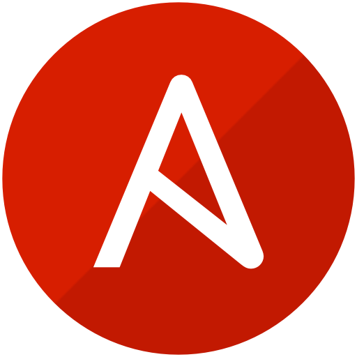

I am an IT-Security Engineer based in Germany, focusing on offensive and defensive security 🔐.  
I currently work at [MAX STREICHER GmbH & Co. KG aA](https://www.streicher.de/), supporting security‑related processes and technical improvements ⚙️.

 

A selection of languages, frameworks and software that I have experience with:

  
  
  
  
  
  
  
  
  

 

In addition, I am currently learning about the following:

  

 

  
  

    <h3>My favourite project I work on ❤️</h3>
    
  

 

**Checkout one of my repositories pinned below! Leave a star⭐ if you like them❤️!**
